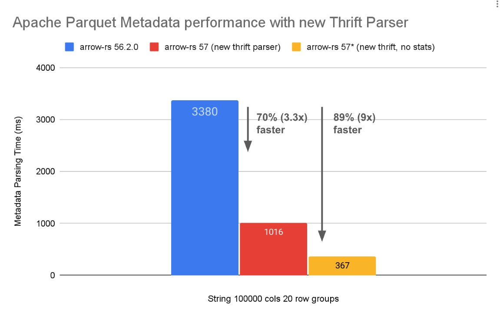

# Apache Parquet [Metadata Parsing Benchmarks]

[Metadata Parsing Benchmarks]: https://github.com/alamb/parquet_footer_parsing

## Summary

This benchmarks demonstrates nearly an order of magnitude improvement (7x)
parsing Parquet metadata with **no changes to the Parquet format**, by simply
writing a more efficient thrift decoder.

While we have not implemented a similar decoder in other languages such as C/C++
or Java, given the similarities in the existing thrift libraries and usage, we
expect similar improvements are possible in those languages as well.



**Figure 1**: Benchmark results for [Apache Parquet] metadata parsing using the [new thrift decoder] in [arrow-rs], scheduled for release in 
[57.0.0]. No changes are needed to the Parquet format itself.


**Figure 2**: Speedup for Apache Parquet metadata parsing for varying data types and column counts.

[Apache Parquet]: https://parquet.apache.org/
[arrow-rs]: https://github.com/apache/arrow-rs
[57.0.0]: https://github.com/apache/arrow-rs/issues/7835


*Note 1: the "no stats" version is a modified version of the new thrift parser
that skips over all index structures entirely, including statistics on column
chunks as well as page and offset indexes.*

*Note 2: These results show the theoretical best case improvements (e.g. when
doing point lookups in Parquet files using an external index, as explained in
the [Using External Indexes, Metadata Stores, Catalogs and Caches to Accelerate
Queries on Apache Parquet]). Most workloads will see more modest improvements.*

[Using External Indexes, Metadata Stores, Catalogs and Caches to Accelerate Queries on Apache Parquet]: https://datafusion.apache.org/blog/2025/08/15/external-parquet-indexes/
[Apache DataFusion]: https://datafusion.apache.org/

## Introduction

Recently, the Parquet community has been evaluating [a proposal to add a new
footer format to Apache Parquet] (also a direct link to the [doc]) to address
some of the perceived shortcomings of the existing thrift format, including
the lack of random access parsing and the complexity of the thrift format.

[a proposal to add a new footer format to Apache Parquet]: https://lists.apache.org/thread/j9qv5vyg0r4jk6tbm6sqthltly4oztd3
[doc]: https://docs.google.com/document/d/1kZS_DM_J8n6NKff3vDQPD1Y4xyDdRceYFANUE0bOfb0/edit?tab=t.0#heading=h.ccu4zzsy0tm5

In parallel, the arrow-rs community has been exploring ways to improve the
performance of Parquet metadata parsing in Rust using the existing thrift
format, by implementing a more efficient [new thrift decoder]. In addition to
avoiding some overheads, the new decoder also allows for skipping over unneeded
fields more easily, which can be a significant performance improvement for wide
tables with many columns and row groups.

Thus, the natural question arises of how much performance improvement is possible
with this new thrift decoder, and how does it compare to the proposed new footer
format. See the [benchmarking ticket] for more context and discussion.


[benchmarking ticket]: https://github.com/apache/arrow-rs/issues/8441
[new thrift decoder]: https://github.com/apache/arrow-rs/issues/5854


## Background

Apache Parquet is a popular columnar storage format for big data processing. It
is designed to be efficient for both storage and query performance. Parquet
files consist of a header, a series of row groups, and a footer. The footer
contains metadata about the file, including the schema, statistics, and other
information needed to read and process the data.

Footer parsing is a critical step in reading Parquet files, as it provides the
necessary information to interpret the data. For systems that do not cache the
parsed footer, the performance of footer parsing can have a significant impact
on  overall query performance files, especially for files with many columns /
row groups.

An often criticized part of the Parquet format is that it uses [Apache Thrift]
for serialization of the metadata. Thrift is a flexible and efficient
serialization framework, but does not provide random access parsing. Other
formats such as [Flatbuffers] which do provide zero copy and random access
parsing have been proposed as alternatives given their theoretical performance
advantages. However, changing the Parquet format is a significant undertaking,
and requires buy-in from the community and ecosystem and can take years to be
adopted.

Despite the very real disadvantage of thrift, we have previously theorized in 
[How Good is Parquet for Wide Tables (Machine Learning Workloads) Really?] that
there is still room for significant performance improvements in Parquet footer
parsing in Rust using the existing thrift format but improving the thrift
decoder implementation.

[How Good is Parquet for Wide Tables (Machine Learning Workloads) Really?]: https://www.influxdata.com/blog/how-good-parquet-wide-tables/

## Running the Benchmark

To run the benchmarks, first [install Rust], and then clone this repository and
run the benchmarks using the following commands:

```shell
cargo run --release
```

[install Rust]: https://www.rust-lang.org/tools/install

## Benchmark Description

### Datasets

The benchmark makes several parquet files with the following characteristics:

| Name               | Description                                                                     |
|--------------------|---------------------------------------------------------------------------------|
| columns            | The number of columns in the schema                                             |
| row groups         | Each file has 20 row groups                                                     |
| rows per row group | Each row group has 1000 rows                                                    |
| DataType: Float | The columns are Float32                                                         |
| DataType: String| The columns are String (avg length 10 characters, max length 20 characters)     |

You can examine details of the metadata parquet files in the `data` directory using `datafusion-cli`:

```shell
datafusion-cli -c "select * from parquet_metadata('output/String_data_100_cols.parquet');
```

### Decoders / Configurations`

| Name                   | Description                                                                                                                                                                       |
|------------------------|-----------------------------------------------------------------------------------------------------------------------------------------------------------------------------------|
| `Arrow 56`             | Using the [released version of parquet 56.2.0]                                                                                                                                    |
| `Arrow 57`             | Using a [snapshot](https://github.com/alamb/arrow-rs/tree/alamb/thrift-remodel-snapshot) of the remodel branch (based on [this PR](https://github.com/apache/arrow-rs/pull/8476)) |
| `Arrow 57 (no stats)`  | A modification to the above, manually updated to skip parsing all index structures (see [changes in this PR](https://github.com/alamb/arrow-rs/pull/54))                          |

[released version of parquet 56.2.0]:https://crates.io/crates/parquet/56.2.0

`Arrow 57 (no stats)` shows the theoretical best case once arrow-rs offers and
API to selectively skip parsing of unnecessary fields [see this
ticket](https://github.com/apache/arrow-rs/issues/5855), such as statistics for
columns which do not have predicates on them. The version in this benchmark
skips both [statistics on column chunks] as well as the [PageIndex].

[statistics on column chunks]: https://github.com/apache/parquet-format/blob/9fd57b59e0ce1a82a69237dcf8977d3e72a2965d/src/main/thrift/parquet.thrift#L912-L939
[PageIndex]: https://github.com/apache/parquet-format/blob/master/PageIndex.md

# Results

As shown in Figure 1 and 2, across the board, we see a 7x speedup (86% reduction) for
decoding metadata when using the new thrift decoder in arrow-rs and skipping the
parsing of statistics and index structures entirely. Without skipping the
parsing of statistics and index structures, we see about a 1.85x speedup overall 


For example, with the
`String 100000 cols 20 row groups ` dataset, we go from a total time of 3.63s
`(1.31s + 2.32s = 3.63s)` to 0.52s `(0.52s + 0s = 0.52s)`


This is roughly in line with the 80% performance reduction results
@adrian-thurston saw in internal benchmarks of InfluxData production workloads,
when being more deliberate about which PageIndexes were decoded. See [Reduce
page metadata loading to only what is necessary for query execution in
ParquetOpen #16200] for more details. 

[Reduce page metadata loading to only what is necessary for query execution in ParquetOpen #16200]: https://github.com/apache/datafusion/issues/16200

Results (see also [Spreadsheet] for source and diagrams)

[Spreadsheet]: https://docs.google.com/spreadsheets/d/1Ypsox5EywNmv9ORwrlmJlWcPVvWlOW_QCnIt_U68vbo/edit?gid=1818026620#gid=1818026620

```text
+-----------------------------------+---------------------+---------------------------+---------------------+---------------------------+--------------------------------+--------------------------------+
| Description                       | Parse Time Arrow 56 | Parse Time Arrow 56       | Parse Time Arrow 57 | Parse Time Arrow 57       | Parse Time Arrow 57 (no stats) | Parse Time Arrow 57 (no stats) |
|                                   |                     |                           |                     |                           |                                |                                |
|                                   | Metadata            | PageIndex (Column/Offset) | Metadata            | PageIndex (Column/Offset) | Metadata                       | PageIndex (Column/Offset)      |
+=========================================================================================================================================================================================================+
|  Float 100 cols 20 row groups     | 1.282087ms          | 2.104241ms                | 462.329µs           | 339.566µs                 | 456.941µs                      | 0ns                            |
|-----------------------------------+---------------------+---------------------------+---------------------+---------------------------+--------------------------------+--------------------------------|
|  Float 1000 cols 20 row groups    | 11.546712ms         | 18.854125ms               | 4.440495ms          | 3.199141ms                | 4.188645ms                     | 0ns                            |
|-----------------------------------+---------------------+---------------------------+---------------------+---------------------------+--------------------------------+--------------------------------|
|  Float 10000 cols 20 row groups   | 129.603108ms        | 207.579545ms              | 48.158095ms         | 41.022491ms               | 43.825658ms                    | 0ns                            |
|-----------------------------------+---------------------+---------------------------+---------------------+---------------------------+--------------------------------+--------------------------------|
|  Float 100000 cols 20 row groups  | 1.260400591s        | 2.099193066s              | 478.69082ms         | 458.817029ms              | 430.266691ms                   | 0ns                            |
|-----------------------------------+---------------------+---------------------------+---------------------+---------------------------+--------------------------------+--------------------------------|
|  String 100 cols 20 row groups    | 1.075608ms          | 1.928337ms                | 498.17µs            | 407.537µs                 | 428.287µs                      | 0ns                            |
|-----------------------------------+---------------------+---------------------------+---------------------+---------------------------+--------------------------------+--------------------------------|
|  String 1000 cols 20 row groups   | 10.642924ms         | 19.239137ms               | 4.93742ms           | 4.021074ms                | 4.197987ms                     | 0ns                            |
|-----------------------------------+---------------------+---------------------------+---------------------+---------------------------+--------------------------------+--------------------------------|
|  String 10000 cols 20 row groups  | 120.67337ms         | 207.785612ms              | 53.254054ms         | 48.329137ms               | 42.2108ms                      | 0ns                            |
|-----------------------------------+---------------------+---------------------------+---------------------+---------------------------+--------------------------------+--------------------------------|
|  String 100000 cols 20 row groups | 1.19098462s         | 2.136180862s              | 536.613987ms        | 547.262754ms              | 418.881158ms                   | 0ns                            |
+-----------------------------------+---------------------+---------------------------+---------------------+---------------------------+--------------------------------+--------------------------------+
```

CSV:
```csv
Description,Parse Time Arrow 56 Metadata (ms),Parse Time Arrow 56 PageIndex (Column/Offset) (ms),Parse Time Arrow 57 Metadata (ms),Parse Time Arrow 57 PageIndex (Column/Offset) (ms),Parse Time Arrow 57 (no stats) Metadata (ms),Parse Time Arrow 57 (no stats) PageIndex (Column/Offset) (ms)
 Float 100 cols 20 row groups,1,2,0,0,0,0
 Float 1000 cols 20 row groups,11,18,4,3,4,0
 Float 10000 cols 20 row groups,129,207,48,41,43,0
 Float 100000 cols 20 row groups,1260,2099,478,458,430,0
 String 100 cols 20 row groups,1,1,0,0,0,0
 String 1000 cols 20 row groups,10,19,4,4,4,0
 String 10000 cols 20 row groups,120,207,53,48,42,0
 String 100000 cols 20 row groups,1190,2136,536,547,418,0
```


